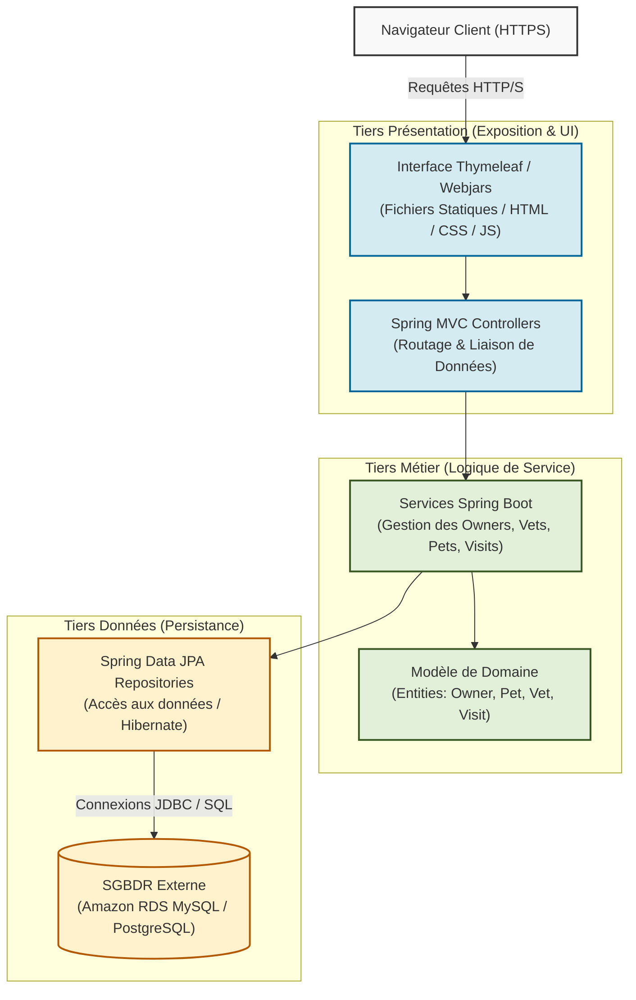

# TP3 — Spring PetClinic : Analyse de l'application (Partie A)

Ce document présente l'analyse de l'application **Spring PetClinic** afin de fonder et de justifier les décisions d'architecture pour son déploiement de production sur **AWS**.

---

## 1. Caractérisation et Justification de l'Architecture

### • Découpage en tiers et nature du composant à exécuter
* **Caractérisation :** L'application suit une architecture logique classique à **3-tiers** : la couche de présentation (Thymeleaf, HTML5, Bootstrap, Webjars), la couche métier (Services Spring Boot, modèles de domaine) et la couche d'accès aux données (Spring Data JPA, Hibernate). 
* **Justification :** Bien que logiquement séparées, les couches de présentation et métier sont packagées dans un seul livrable monolithique. Nous choisissons d'exécuter ce composant sous forme de **conteneur Docker** (plutôt qu'un simple JAR brut) afin de garantir une parfaite cohérence environnementale du développement à la production et de faciliter son orchestration sur un service managé comme AWS ECS Fargate ou Elastic Beanstalk.

### • État applicatif : stateless vs stateful
* **Caractérisation :** Le serveur d'application Spring Boot est entièrement **stateless** (sans état), tandis que la base de données relationnelle est **stateful** (conserve l'état des données).
* **Justification :** N'ayant aucun stockage de fichiers local ni de sessions utilisateur persistantes côté serveur (les sessions peuvent être gérées par des cookies ou externalisées si nécessaire), les instances de l'application peuvent être démarrées, arrêtées ou multipliées à la volée. Toute donnée d'état (données des propriétaires, des animaux et des visites) doit être rigoureusement externalisée dans la base de données relationnelle managée pour permettre une élasticité horizontale sans perte de données.

### • Persistance : choix MySQL/PostgreSQL et conséquences RDS
* **Caractérisation :** Le projet supporte nativement **MySQL** et **PostgreSQL** via des profils Spring Boot spécifiques (`mysql` et `postgres`). Nous optons pour **MySQL** pour ce déploiement.
* **Justification :** Ce choix permet d'utiliser **Amazon RDS for MySQL** en mode **Multi-AZ**, garantissant des sauvegardes automatisées, des correctifs système transparents et une réplication synchrone vers une zone secondaire. L'utilisation de RDS décharge l'équipe de l'administration du SGBD, mais impose de configurer des variables d'environnement Spring Boot (`spring.datasource.url`, etc.) pour cibler le point de terminaison du service managé ou de l'éventuel RDS Proxy.

### • Besoins de disponibilité, de montée en charge et de tolérance aux pannes
* **Caractérisation :** L'application cible une haute disponibilité en production avec une tolérance aux pannes de niveau matériel/zone et une adaptation dynamique à la charge de trafic.
* **Justification :** Pour tolérer la panne d'un centre de données complet, l'architecture doit s'étendre sur **au moins deux zones de disponibilité (Multi-AZ)** pour l'application (gérée par un Auto Scaling Group) et pour la base de données (instance RDS principale et réplique de basculement). Un **Application Load Balancer (ALB)** distribuera le trafic entre les instances saines de chaque AZ et effectuera des contrôles de santé continus (*health checks*) pour isoler automatiquement les instances défaillantes.

### • Gestion de la configuration et des secrets
* **Caractérisation :** Les configurations dynamiques (profils, URLs) et les secrets sensibles (identifiants et mots de passe de la base de données) doivent être séparés du code source.
* **Justification :** Les paramètres non sensibles sont injectés via des variables d'environnement standards, tandis que les identifiants de connexion à la base de données sont stockés de manière sécurisée dans **AWS Secrets Manager**. À l'aide de rôles IAM de tâche/instance, l'application récupère ces secrets au démarrage sans qu'aucune clé ou mot de passe ne soit stocké en clair dans le code ou dans l'infrastructure de conteneurs.

### • Surface de sécurité : exposition réseau, accès d'administration et chiffrement
* **Caractérisation :** La surface d'exposition doit être minimale, avec un cloisonnement strict du réseau, un contrôle rigoureux des accès d'administration et un chiffrement global.
* **Justification :** Seul l'ALB est placé dans les sous-réseaux publics pour recevoir le trafic internet, tandis que l'application et la base de données sont reléguées dans des sous-réseaux privés hermétiques, protégés par des groupes de sécurité chaînés (ALB $\rightarrow$ Instances Applicatives $\rightarrow$ RDS). Tout accès administratif direct (comme SSH) est bloqué au profit d'**AWS Systems Manager (Session Manager)** pour éviter d'exposer des ports d'administration, et l'ensemble des données est chiffré en transit (HTTPS via AWS Certificate Manager) et au repos (via des clés AWS KMS pour RDS et EBS).

---

## 2. Diagramme d'Architecture Logique (3-Tiers)

Voici comment s'organise le flux logique de l'application Spring PetClinic :

